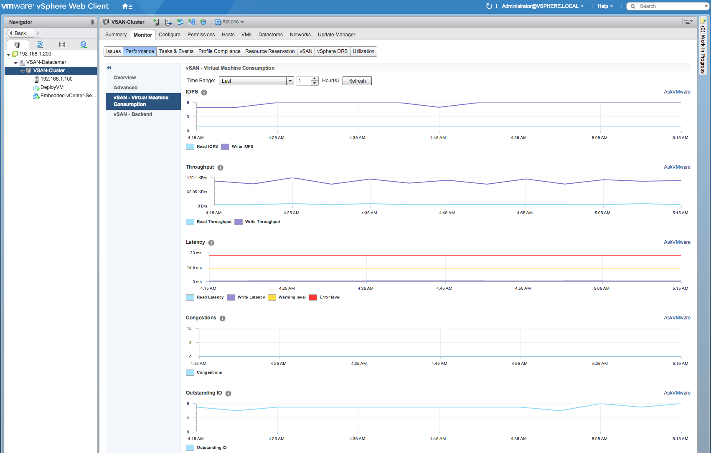

# Correlating vSAN perf metrics from vSphere Web Client to both PowerCLI & vSAN Mgmt API

For more details, please refer to this blog post [here](http://www.virtuallyghetto.com/2017/04/correlating-vsan-perf-metrics-from-vsphere-web-client-to-both-powercli-vsan-mgmt-api.html)

**vSAN Performance Metrics found in the vSphere Cluster UI**

* [Cluster: vSAN Virtual Machine Consumption](#cluster-vsan-virtual-machine-consumption)
    * [PowerCLI Sample for Cluster: vSAN Virtual Machine Consumption](#powercli-sample-for-cluster-vsan-virtual-machine-consumption)
* [Cluster: vSAN Backend](#cluster-vsan-backend)
    * [PowerCLI Sample for Cluster: vSAN Backend](#powercli-sample-for-cluster-vsan-backend)
* [Cluster: vSAN iSCSI Target](#cluster-vsan-iscsi-target)
    * [PowerCLI Sample for Cluster: vSAN iSCSI Target](#powercli-sample-for-cluster-vsan-iscsi-target)
* [Cluster: vSAN iSCSI LUN](#cluster-vsan-iscsi-lun)
    * [PowerCLI Sample for Cluster: vSAN iSCSI LUN](#powercli-sample-for-cluster-vsan-iscsi-lun)

**vSAN Performance Metrics found in the ESXi Host UI**

* [Host: vSAN Virtual Machine Consumption](#host-vsan-virtual-machine-consumption)
    * [PowerCLI Sample for Host: vSAN Virtual Machine Consumption](#powercli-sample-for-host-vsan-virtual-machine-consumption)
* [Host: vSAN Backend](#host-vsan-backend)
    * [PowerCLI Sample for Host: vSAN Backend](#powercli-sample-for-host-vsan-backend)
* [Host: vSAN Diskgroup](#host-vsan-diskgroup)
    * [PowerCLI Sample for Host: vSAN Diskgroup](#powercli-sample-for-host-vsan-diskgroup)
* [Host: vSAN Disk](#host-vsan-disk)
    * [PowerCLI Sample for Host: vSAN Disk](#powercli-sample-for-host-vsan-disk)
* [Host: vSAN Physical Adapters](#host-vsan-physical-adapters)
    * [PowerCLI Sample for Host: vSAN Physical Adapters](#powercli-sample-for-host-vsan-physical-adapters)
* [Host: vSAN VMkernel Adapters](#host-vsan-vmkernel-adapters)
    * [PowerCLI Sample for Host: vSAN VMkernel Adapters](#powercli-sample-for-host-vsan-vmkernel-adapters)
* [Host: vSAN VMkernel Adapters Aggregation](#host-vsan-vmkernel-adapters-aggregation)
    * [PowerCLI Sample for Host: vSAN VMkernel Adapters Aggregation](#powercli-sample-for-host-vsan-vmkernel-adapters-aggregation)
* [Host: vSAN iSCSI](#host-vsan-iscsi)
    * [PowerCLI Sample for Host: vSAN iSCSI](#powercli-sample-for-host-vsan-iscsi)

**vSAN Performance Metrics found in the Virtual Machine UI**

* [VM: vSAN Virtual Machine Consumption](#vm-vsan-virtual-machine-consumption)
    * [PowerCLI Sample for VM: vSAN Virtual Machine Consumption](#powercli-sample-for-vm-vsan-virtual-machine-consumption)
* [VM: vSAN Virtual Disk](#vm-vsan-virtual-disk)
    * [PowerCLI Sample for VM: vSAN Virtual Disk](#powercli-sample-for-vm-vsan-virtual-disk)

## Cluster: vSAN Virtual Machine Consumption



### Metrics

| Metric Type    | Metric           | PowerCLI                          | vSAN Mgmt API Entity | vSAN Mgmt API Metric |
|----------------|------------------|-----------------------------------|----------------------|----------------------|
| IOPS           | Read IOPS        | VMConsumption.ReadIops            | cluster-domclient    | iopsRead             |
| IOPS           | Write IOPS       | VMConsumption.WriteIop            | cluster-domclient    | iopsWrite            |
| Throughput     | Read Throughput  | VMConsumption.ReadThroughput      | cluster-domclient    | throughputRead       |
| Throughput     | Write Throughput | VMConsumption.WriteThroughput     | cluster-domclient    | throughputWrite      |
| Latency        | Read Latency     | VMConsumption.AverageReadLatency  | cluster-domclient    | latencyAvgRead       |
| Latency        | Write Latency    | VMConsumption.AverageWriteLatency | cluster-domclient    | latencyAvgWrite      |
| Congestions    | Congestions      | VMConsumption.Congestion          | cluster-domclient    | congestion           |
| Outstanding IO | Outstanding IO   | VMConsumption.OutstandingIO       | cluster-domclient    | oio                  |

### PowerCLI Sample for Cluster: vSAN Virtual Machine Consumption

```code
$cluster = Get-Cluster -Name VSAN-Cluster
Get-VsanStat -Entity $cluster -Name VMConsumption.ReadIops -StartTime "4/21/2017 2:50:00 PM" -EndTime "4/21/2017 3:50:00 PM"

Entity                    Name                      Time                      Value     
------                    ----                      ----                      -----     
VSAN-Cluster              VMConsumption.ReadIops    4/21/2017 2:50:00 PM      1         
VSAN-Cluster              VMConsumption.ReadIops    4/21/2017 2:55:00 PM      2         
VSAN-Cluster              VMConsumption.ReadIops    4/21/2017 3:00:00 PM      1         
VSAN-Cluster              VMConsumption.ReadIops    4/21/2017 3:05:00 PM      1         
VSAN-Cluster              VMConsumption.ReadIops    4/21/2017 3:10:00 PM      1         
VSAN-Cluster              VMConsumption.ReadIops    4/21/2017 3:15:00 PM      1         
VSAN-Cluster              VMConsumption.ReadIops    4/21/2017 3:20:00 PM      1         
VSAN-Cluster              VMConsumption.ReadIops    4/21/2017 3:25:00 PM      1         
VSAN-Cluster              VMConsumption.ReadIops    4/21/2017 3:30:00 PM      1         
VSAN-Cluster              VMConsumption.ReadIops    4/21/2017 3:35:00 PM      1         
VSAN-Cluster              VMConsumption.ReadIops    4/21/2017 3:40:00 PM      1         
VSAN-Cluster              VMConsumption.ReadIops    4/21/2017 3:45:00 PM      1         
VSAN-Cluster              VMConsumption.ReadIops    4/21/2017 3:50:00 PM      1         
```

## Cluster: vSAN Backend


### Metrics

| Metric Type    | Metric                  | PowerCLI                            | vSAN Mgmt API Entity | vSAN Mgmt API Metric |
|----------------|-------------------------|-------------------------------------|----------------------|----------------------|
| IOPS           | Read IOPS               | Backend.ReadIops                    | cluster-domcompmgr   | iopsRead             |
| IOPS           | Resync Read IOPS        | Backend.ResyncReadIops              | cluster-domcompmgr   | iopsResyncRead       |
| IOPS           | Write IOPS              | Backend.WriteIops                   | cluster-domcompmgr   | iopsWrite            |
| IOPS           | Recovery Write IOPS     | Backend.RecoveryWriteIops           | cluster-domcompmgr   | iopsRecWrite         |
| Throughput     | Read Throughput         | Backend.ReadThroughput              | cluster-domcompmgr   | throughputRead       |
| Throughput     | Resync Read Throughput  | Backend.ResyncReadThroughput        | cluster-domcompmgr   | tputResyncRead       |
| Throughput     | Write Throughput        | Backend.WriteThroughput             | cluster-domcompmgr   | throughputWrite      |
| Throughput     | Resync Write Throughput | Backend.RecoveryWriteThroughput     | cluster-domcompmgr   | throughputRecWrite   |
| Latency        | Read Latency            | Backend.AverageReadLatency          | cluster-domcompmgr   | latencyAvgRead       |
| Latency        | Resync Read Latency     | Backend.ResyncReadLatency           | cluster-domcompmgr   | latAvgResyncRead     |
| Latency        | Write Latency           | Backend.AverageWriteLatency         | cluster-domcompmgr   | latencyAvgWrite      |
| Latency        | Recovery Write Latency  | Backend.RecoveryWriteAverageLatency | cluster-domcompmgr   | latencyAvgRecWrite   |
| Congestions    | Congestions             | Backend.Congestion                  | cluster-domcompmgr   | congestion           |
| Outstanding IO | Outstanding IO          | Backend.OutstandingIO               | cluster-domcompmgr   | oio                  |

### PowerCLI Sample for Cluster: vSAN Backend

```code
$cluster = Get-Cluster -Name VSAN-Cluster
Get-VsanStat -Entity $cluster -Name Backend.ReadIops -StartTime "4/21/2017 2:50:00 PM" -EndTime "4/21/2017 3:50:00 PM"

Entity                    Name                      Time                      Value     
------                    ----                      ----                      -----     
VSAN-Cluster              Backend.ReadIops          4/21/2017 2:50:00 PM      2         
VSAN-Cluster              Backend.ReadIops          4/21/2017 2:55:00 PM      4         
VSAN-Cluster              Backend.ReadIops          4/21/2017 3:00:00 PM      2         
VSAN-Cluster              Backend.ReadIops          4/21/2017 3:05:00 PM      2         
VSAN-Cluster              Backend.ReadIops          4/21/2017 3:10:00 PM      2         
VSAN-Cluster              Backend.ReadIops          4/21/2017 3:15:00 PM      2         
VSAN-Cluster              Backend.ReadIops          4/21/2017 3:20:00 PM      2         
VSAN-Cluster              Backend.ReadIops          4/21/2017 3:25:00 PM      2         
VSAN-Cluster              Backend.ReadIops          4/21/2017 3:30:00 PM      2         
VSAN-Cluster              Backend.ReadIops          4/21/2017 3:35:00 PM      2         
VSAN-Cluster              Backend.ReadIops          4/21/2017 3:40:00 PM      2         
VSAN-Cluster              Backend.ReadIops          4/21/2017 3:45:00 PM      2         
VSAN-Cluster              Backend.ReadIops          4/21/2017 3:50:00 PM      2         
```

## Cluster: vSAN iSCSI Target


### Metrics

| Metric Type    | Metric          | PowerCLI                       | vSAN Mgmt API Entity | vSAN Mgmt API Metric |
|----------------|-----------------|--------------------------------|----------------------|----------------------|
| IOPS           | Read IOPS       | Performance.ReadIops           | vsan-iscsi-target    | iopsRead             |
| IOPS           | Write IOPS      | Performance.WriteIops          | vsan-iscsi-target    | iopsWrite            |
| IOPS           | Total IOPS      | Performance.TotalIops          | vsan-iscsi-target    | iopsTotal            |
| Bandwidth      | Read Bandwidth  | Performance.ReadBandwidth      | vsan-iscsi-target    | bandwidthRead        |
| Bandwidth      | Write Bandwidth | Performance.WriteBandwidth     | vsan-iscsi-target    | bandwidthWrite       |
| Bandwidth      | Total Bandwidth | Performance.TotalBandwidth     | vsan-iscsi-target    | bandwidthTotal       |
| Latency        | Read Latency    | Performance.ReadLatency        | vsan-iscsi-target    | latencyRead          |
| Latency        | Write Latency   | Performance.WriteLatency       | vsan-iscsi-target    | latencyWrite         |
| Latency        | Total Latency   | Performance.TotalLatency       | vsan-iscsi-target    | latencyTotal         |
| Outstanding IO | Oustanding IO   | Performance.IscsiOutstandingIO | vsan-iscsi-target    | queueDepth           |

### PowerCLI Sample for Cluster: vSAN iSCSI Target

```code
$iscsiTarget = Get-VsanIscsiTarget | Select -First 1
Get-VsanStat -Entity $iscsiTarget -Name Performance.ReadIops -StartTime "4/23/2017 2:50:00 AM" -EndTime "4/23/2017 3:10:00 AM"

Entity                    Name                      Time                      Value     
------                    ----                      ----                      -----     
vsan-target-1             Performance.ReadIops      4/23/2017 2:50:00 AM      0         
vsan-target-1             Performance.ReadIops      4/23/2017 2:55:00 AM      0         
vsan-target-1             Performance.ReadIops      4/23/2017 3:00:00 AM      0         
vsan-target-1             Performance.ReadIops      4/23/2017 3:05:00 AM      0         
vsan-target-1             Performance.ReadIops      4/23/2017 3:10:00 AM      0         
```

## Cluster: vSAN iSCSI LUN


### Metrics

| Metric Type    | Metric          | PowerCLI                       | vSAN Mgmt API Entity | vSAN Mgmt API Metric |
|----------------|-----------------|--------------------------------|----------------------|----------------------|
| IOPS           | Read IOPS       | Performance.ReadIops           | vsan-iscsi-lun       | iopsRead             |
| IOPS           | Write IOPS      | Performance.WriteIops          | vsan-iscsi-lun       | iopsWrite            |
| IOPS           | Total IOPS      | Performance.TotalIops          | vsan-iscsi-lun       | iopsTotal            |
| Bandwidth      | Read Bandwidth  | Performance.ReadBandwidth      | vsan-iscsi-lun       | bandwidthRead        |
| Bandwidth      | Write Bandwidth | Performance.WriteBandwidth     | vsan-iscsi-lun       | bandwidthWrite       |
| Bandwidth      | Total Bandwidth | Performance.TotalBandwidth     | vsan-iscsi-lun       | bandwidthTotal       |
| Latency        | Read Latency    | Performance.ReadLatency        | vsan-iscsi-lun       | latencyRead          |
| Latency        | Write Latency   | Performance.WriteLatency       | vsan-iscsi-lun       | latencyWrite         |
| Latency        | Total Latency   | Performance.TotalLatency       | vsan-iscsi-lun       | latencyTotal         |
| Outstanding IO | Oustanding IO   | Performance.IscsiOutstandingIO | vsan-iscsi-lun       | queueDepth           |

### PowerCLI Sample for Cluster: vSAN LUN

```code
$iscsiLUN = Get-VsanIscsiLun | Select -First 1
Get-VsanStat -Entity $iscsiLUN -Name Performance.ReadIops -StartTime "4/23/2017 1:00:00 AM" -EndTime "4/23/2017 1:15:00 AM"

Entity                    Name                      Time                      Value     
------                    ----                      ----                      -----     
vsan-target-1             Performance.ReadIops      4/23/2017 1:00:00 AM      0         
vsan-target-1             Performance.ReadIops      4/23/2017 1:05:00 AM      0         
vsan-target-1             Performance.ReadIops      4/23/2017 1:10:00 AM      0         
vsan-target-1             Performance.ReadIops      4/23/2017 1:15:00 AM      0         
```

## Host: vSAN Virtual Machine Consumption


### Metrics

| Metric Type                 | Metric                      | PowerCLI                               | vSAN Mgmt API Entity | vSAN Mgmt API Metric |
|-----------------------------|-----------------------------|----------------------------------------|----------------------|----------------------|
| IOPS                        | Read IOPS                   | VMConsumption.ReadIops                 | host-domclient       | iopsRead             |
| IOPS                        | Write IOPS                  | VMConsumption.WriteIops                | host-domclient       | iopsWrite            |
| Throughput                  | Read Throughput             | VMConsumption.ReadThroughput           | host-domclient       | throughputRead       |
| Throughput                  | Write Throughput            | VMConsumption.WriteThroughput          | host-domclient       | throughputWrite      |
| Latency                     | Read Latency                | VMConsumption.AverageReadLatency       | host-domclient       | latencyAvgRead       |
| Latency                     | Write Latency               | VMConsumption.AverageWriteLatency      | host-domclient       | latencyAvgWrite      |
| Local Client Cache Hit IOPS | Local Client Cache Hit IOPS | VMConsumption.ClientCacheHitsIops      | host-domclient       | clientCacheHits      |
| Local Client Cache Hit Rate | Local Client Cache Hit Rate | VMConsumption.ClientCacheHitRate       | host-domclient       | clientCacheHitRate   |
| Congestions                 | Congestions                 | VMConsumption.Congestion               | host-domclient       | congestion           |
| Outstanding IO              | Outstanding IO              | VMConsumption.OutstandingIO            | host-domclient       | oio                  |

### PowerCLI Sample for Host: vSAN Virtual Machine Consumption

```code
$vmhost = Get-VMhost -Name 192.168.1.100
Get-VsanStat -Entity $vmhost -Name VMConsumption.ReadIops -StartTime "4/21/2017 2:50:00 PM" -EndTime "4/21/2017 3:50:00 PM"

Entity                    Name                      Time                      Value     
------                    ----                      ----                      -----     
192.168.1.100             VMConsumption.ReadIops    4/21/2017 2:50:00 PM      1         
192.168.1.100             VMConsumption.ReadIops    4/21/2017 2:55:00 PM      2         
192.168.1.100             VMConsumption.ReadIops    4/21/2017 3:00:00 PM      1         
192.168.1.100             VMConsumption.ReadIops    4/21/2017 3:05:00 PM      1         
192.168.1.100             VMConsumption.ReadIops    4/21/2017 3:10:00 PM      1         
192.168.1.100             VMConsumption.ReadIops    4/21/2017 3:15:00 PM      1         
192.168.1.100             VMConsumption.ReadIops    4/21/2017 3:20:00 PM      1         
192.168.1.100             VMConsumption.ReadIops    4/21/2017 3:25:00 PM      1         
192.168.1.100             VMConsumption.ReadIops    4/21/2017 3:30:00 PM      1         
192.168.1.100             VMConsumption.ReadIops    4/21/2017 3:35:00 PM      1         
192.168.1.100             VMConsumption.ReadIops    4/21/2017 3:40:00 PM      1         
192.168.1.100             VMConsumption.ReadIops    4/21/2017 3:45:00 PM      1         
192.168.1.100             VMConsumption.ReadIops    4/21/2017 3:50:00 PM      1   
```


## Host: vSAN Backend


### Metrics

| Metric Type       | Metric                    | PowerCLI                            | vSAN Mgmt API Entity | vSAN Mgmt API Metric |
|-------------------|---------------------------|-------------------------------------|----------------------|----------------------|
| IOPS              | Read IOPS                 | Backend.ReadIops                    | host-domcompmgr      | iopsRead             |
| IOPS              | Write IOPS                | Backend.WriteIops                   | host-domcompmgr      | iopsWrite            |
| Throughput        | Read Throughput           | Backend.ReadThroughput              | host-domcompmgr      | throughputRead       |
| Throughput        | Write Throughput          | Backend.WriteThroughput             | host-domcompmgr      | throughputWrite      |
| Latency           | Read Latency              | Backend.AverageReadLatency          | host-domcompmgr      | latencyAvgRead       |
| Latency           | Write Latency             | Backend.AverageWriteLatency         | host-domcompmgr      | latencyAvgWrite      |
| Resync IOPS       | Resync Read IOPS          | Backend.ResyncReadIops              | host-domcompmgr      | iopsResyncRead       |
| Resync IOPS       | Recovery Write IOPS       | Backend.RecoveryWriteIops           | host-domcompmgr      | iopsRecWrite         |
| Resync Throughput | Resync Read Throughput    | Backend.ResyncReadThroughput        | host-domcompmgr      | tputResyncRead       |
| Resync Throughput | Recovery Write Throughput | Backend.RecoveryWriteThroughput     | host-domcompmgr      | throughputRecWrite   |
| Resync Latency    | Resync Read Latency       | Backend.ResyncReadLatency           | host-domcompmgr      | latAvgResyncRead     |
| Resync Latency    | Recovery Write Latency    | Backend.RecoveryWriteAverageLatency | host-domcompmgr      | latencyAvgRecWrite   |
| Congestions       | Congestions               | Backend.Congestion                  | host-domcompmgr      | congestion           |
| Outstanding IO    | Outstanding IO            | Backend.OutstandingIO               | host-domcompmgr      | oio                  |

### PowerCLI Sample for Host: vSAN Backend

```code
$vmhost = Get-VMhost -Name 192.168.1.100
Get-VsanStat -Entity $vmhost -Name Backend.ReadIops -StartTime "4/21/2017 2:50:00 PM" -EndTime "4/21/2017 3:50:00 PM"

Entity                    Name                      Time                      Value     
------                    ----                      ----                      -----     
192.168.1.100             Backend.ReadIops          4/21/2017 2:50:00 PM      2         
192.168.1.100             Backend.ReadIops          4/21/2017 2:55:00 PM      4         
192.168.1.100             Backend.ReadIops          4/21/2017 3:00:00 PM      2         
192.168.1.100             Backend.ReadIops          4/21/2017 3:05:00 PM      2         
192.168.1.100             Backend.ReadIops          4/21/2017 3:10:00 PM      2         
192.168.1.100             Backend.ReadIops          4/21/2017 3:15:00 PM      2         
192.168.1.100             Backend.ReadIops          4/21/2017 3:20:00 PM      2         
192.168.1.100             Backend.ReadIops          4/21/2017 3:25:00 PM      2         
192.168.1.100             Backend.ReadIops          4/21/2017 3:30:00 PM      2         
192.168.1.100             Backend.ReadIops          4/21/2017 3:35:00 PM      2         
192.168.1.100             Backend.ReadIops          4/21/2017 3:40:00 PM      2         
192.168.1.100             Backend.ReadIops          4/21/2017 3:45:00 PM      2         
192.168.1.100             Backend.ReadIops          4/21/2017 3:50:00 PM      2         
```

## Host: vSAN Diskgroup


### Metrics

| Frontend (Guest) IOPS        | Frontend Read IOPS             | Performance.ReadCacheWriteIops             | disk-group | iopsRead                 |
|------------------------------|--------------------------------|--------------------------------------------|------------|--------------------------|
| Frontend (Guest) IOPS        | Frontend Write IOPS            | Performance.WriteBufferReadIops            | disk-group | iopsWrite                |
| Frontend (Guest) IOPS        | Read Cache Read IOPS           | Performance.ReadCacheReadIops              | disk-group | iopsRcRead               |
| Frontend (Guest) IOPS        | Write Buffer Write IOPS        | Performance.WriteBufferWriteIops           | disk-group | iopsWbWrite              |
| Frontend (Guest) Throughput  | Frontend Read Throughput       | Performance.ReadThroughput                 | disk-group | throughputRead           |
| Frontend (Guest) Throughput  | Frontend Write Throughput      | Performance.WriteThroughput                | disk-group | throughputWrite          |
| Frontend (Guest) Latency     | Frontend Read Latency          | Performance.AverageReadLatency             | disk-group | latencyAvgRead           |
| Frontend (Guest) Latency     | Frontend Write Latency         | Performance.AverageWriteLatency            | disk-group | latencyAvgWrite          |
| Frontend (Guest) Latency     | Read Cache Read Latency        | Performance.ReadCacheReadLatency           | disk-group | latencyAvgRcRead         |
| Frontend (Guest) Latency     | Write Buffer Write Latency     | Performance.WriteBufferEriteLatency        | disk-group | latencyAvgWbWrite        |
| Overhead IOPS                | Read Cache Write IOPS          | (MISSING IN POWERCLI)                      | disk-group | iopsRcWrite              |
| Overhead IOPS                | Write Buffer Read IOPS         | (MISSING IN POWERCLI)                      | disk-group | iopsWbRead               |
| Overhead IO Latency          | Read Cache Write Latency       | Performance.ReadCacheWriteLatency          | disk-group | latencyRcWrite           |
| Overhead IO Latency          | Write Buffer Read Latency      | Performance.WriteBufferReadLatency         | disk-group | latencyWbRead            |
| Read Cache Hit Rate          | Read Cache Hit Rate            | Performance.ReadCacheHitRate               | disk-group | rcHitRate                |
| Evictions                    | Cache Invalidations            | Performance.CacheInvalidations             | disk-group | warEvictions             |
| Evictions                    | Evictions                      | Performance.Evictions                      | disk-group | quotaEvictions           |
| Write Buffer Free Percentage | Write Buffer Free Percentage   | Performance.WriteBufferFreePercentage      | disk-group | wbFreePct                |
| Capacity and Usage           | Capacity                       | Performance.Capacity                       | disk-group | capacity                 |
| Capacity and Usage           | Used Capacity                  | Performance.UsedCapacity                   | disk-group | capacityUsed             |
| Capacity and Usage           | Reserved Capacity              | Performance.CapacityReserved               | disk-group | capacityReserved         |
| Capacity and Usage           | Read Cache Size                | Performance.ReadCacheSize                  | disk-group | rcSize                   |
| Capacity and Usage           | Write Buffer Size              | Performance.WriteBufferSize                | disk-group | wbSize                   |
| Cached Disk De-stage Rate    | Bytes De-stage from SSD        | Performance.DrainedSsdBytes                | disk-group | ssdBytesDrained          |
| Cached Disk De-stage Rate    | Zero-Bytes De-stage            | Performance.ZeroBytesDrained               | disk-group | zeroBytesDrained         |
| Congestions                  | Mem-Congestion                 | Performance.MemoryCongestion               | disk-group | memCongestion            |
| Congestions                  | Slab-Congestion                | Performance.SlabCongestion                 | disk-group | slabCongestion           |
| Congestions                  | SSD-Congestion                 | Performance.SsdCongestion                  | disk-group | ssdCongestion            |
| Congestions                  | IOPS-Congestion                | Performance.IopsCongestion                 | disk-group | iopsCongestion           |
| Congestions                  | Log-Congestion                 | (MISSING IN POWERCLI)                      | disk-group | logCongestion            |
| Congestions                  | Comp-Congestion                | Performance.CompCongestion                 | disk-group | compCongestion           |
| Outstanding IO               | Outstanding Write OPS          | Performance.WriteOutStandingIO             | disk-group | oioWrite                 |
| Outstanding IO               | Outstanding Recovery Write OPS | Performance.RecoveryWriteOutstandingIO     | disk-group | oioRecWrite              |
| Outstanding IO Size          | Outstanding Write IO Sizes     | Performance.OutstandingIOWriteSize         | disk-group | oioWriteSize             |
| Outstanding IO Size          | Outstanding Recovery IO Sizes  | Performance.OutstandingRecoveryWriteIOSize | disk-group | oioRecWriteSize          |
| Delayed IO Percentage        | Delayed IO Percentage          | Performance.DelayedIOPercentage            | disk-group | iopsDelayPctSched        |
| Delayed IO Average Latency   | Delayed IO Average Latency     | Performance.DelayedIOAverageLatency        | disk-group | latencyDelaySched        |
| Delayed IO Average Latency   | Latency of Namespace Queue     | Performance.QueueLatency                   | disk-group | latencySchedQueueNS      |
| Delayed IO Average Latency   | Latency of Recovery Queue      | Performance.RecoveryQueueLatency           | disk-group | latencySchedQueueRec     |
| Delayed IO Average Latency   | Latency of VM Queue            | Performance.VMQueueLatency                 | disk-group | latencySchedQueueVM      |
| Delayed IO Average Latency   | Latency of Meta Queue          | Performance.MetaQueueLatency               | disk-group | latencySchedQueueMeta    |
| Delayed IOPS                 | Total Delayed IOPS             | Performance.DelayedIops                    | disk-group | iopsSched                |
| Delayed IOPS                 | IOPS of Namespace Queue        | (MISSING IN POWERCLI)                      | disk-group | iopsSchedQueueNS         |
| Delayed IOPS                 | IOPS of Recovery Queue         | Performance.RecoveryQueueIops              | disk-group | iopsSchedQueueRec        |
| Delayed IOPS                 | IOPS of VM Queue               | Performance.VMQueueIops                    | disk-group | iopsSchedQueueVM         |
| Delayed IOPS                 | IOPS of Meta Queue             | Performance.MetaQueueIops                  | disk-group | iopsSchedQueueMeta       |
| Delayed IO Throughput        | Total Queue Throughput         | Performance.QueueThroughput                | disk-group | throughputSched          |
| Delayed IO Throughput        | Throughput of Namespace Queue  | (MISSING IN POWERCLI)                      | disk-group | throughputSchedQueueNS   |
| Delayed IO Throughput        | Throughput of Recovery Queue   | Performance.RecoveryQueueThroughput        | disk-group | throughputSchedQueueRec  |
| Delayed IO Throughput        | Throughput of VM Queue         | Performance.VMQueueThroughput              | disk-group | throughputSchedQueueVM   |
| Delayed IO Throughput        | Throughput of of Meta Queue    | Performance.MetaQueueThroughput            | disk-group | throughputSchedQueueMeta |
| Resync IOPS                  | Policy Change Read             | Performance.PolicyChangeReadIops           | disk-group | iopsResyncReadPolicy     |
| Resync IOPS                  | Evacuation Read                | Performance.EvacuationReadIops             | disk-group | iopsResyncReadDecom      |
| Resync IOPS                  | Rebalance Read                 | Performance.RebalanceReadIops              | disk-group | iopsResyncReadRebalance  |
| Resync IOPS                  | Repair Read                    | Performance.RepairReadIops                 | disk-group | iopsResyncReadFixComp    |
| Resync IOPS                  | Policy Change Write            | Performance.PolicyChangeWriteIops          | disk-group | iopsResyncWritePolicy    |
| Resync IOPS                  | Evacuation Write               | Performance.EvacuationWriteIops            | disk-group | iopsResyncWriteDecom     |
| Resync IOPS                  | Rebalance Write                | Performance.RebalanceWriteIops             | disk-group | iopsResyncWriteRebalance |
| Resync IOPS                  | Repair Write                   | Performance.RepairWriteIops                | disk-group | iopsResyncWriteFixComp   |
| Resync Throughput            | Policy Change Read             | Performance.PolicyChangeReadThroughput     | disk-group | tputResyncReadPolicy     |
| Resync Throughput            | Evacuation Read                | Performance.EvacuationReadThroughput       | disk-group | tputResyncReadDecom      |
| Resync Throughput            | Rebalance Read                 | Performance.RebalanceReadThroughput        | disk-group | tputResyncReadRebalance  |
| Resync Throughput            | Repair Read                    | Performance.RepairReadThroughput           | disk-group | tputResyncReadFixComp    |
| Resync Throughput            | Policy Change Write            | Performance.PolicyChangeWriteThroughput    | disk-group | tputResyncWritePolicy    |
| Resync Throughput            | Decommission Write             | Performance.EvacuationWriteThroughput      | disk-group | tputResyncWriteDecom     |
| Resync Throughput            | Rebalance Write                | Performance.RebalanceWriteThroughput       | disk-group | tputResyncWriteRebalance |
| Resync Throughput            | Repair Write                   | Performance.RepairWriteThroughput          | disk-group | tputResyncWriteFixComp   |
| Resync Latency               | Policy Change Read             | Performance.PolicyChangeReadLatency        | disk-group | latResyncReadPolicy      |
| Resync Latency               | Evacuation Read                | Performance.EvacuationReadLatency          | disk-group | latResyncReadDecom       |
| Resync Latency               | Rebalance Read                 | Performance.RebalanceReadLatency           | disk-group | latResyncReadRebalance   |
| Resync Latency               | Repair Read                    | Performance.RepairReadLatency              | disk-group | latResyncReadFixComp     |
| Resync Latency               | Policy Change Write            | Performance.PolicyChangeWriteLatency       | disk-group | latResyncWritePolicy     |
| Resync Latency               | Evacuation Write               | Performance.EvacuationWriteLatency         | disk-group | latResyncWriteDecom      |
| Resync Latency               | Rebalance Write                | Performance.RebalanceWriteLatency          | disk-group | latResyncWriteRebalance  |
| Resync Latency               | Repair Write                   | Performance.RepairWriteLatency             | disk-group | latResyncWriteFixComp    |

### PowerCLI Sample for Host: vSAN Diskgroup

```code
$diskgroup = Get-VsanDiskGroup | Select -First 1
Get-VsanStat -Entity $diskgroup -Name Performance.ReadCacheWriteIops -StartTime "4/21/2017 2:50:00 PM" -EndTime "4/21/2017 3:50:00 PM"

Entity                    Name                      Time                      Value     
------                    ----                      ----                      -----     
Disk group (0100000000... Performance.ReadCacheW... 4/21/2017 2:50:00 PM      0         
Disk group (0100000000... Performance.ReadCacheW... 4/21/2017 2:55:00 PM      0         
Disk group (0100000000... Performance.ReadCacheW... 4/21/2017 3:00:00 PM      0         
Disk group (0100000000... Performance.ReadCacheW... 4/21/2017 3:05:00 PM      0         
Disk group (0100000000... Performance.ReadCacheW... 4/21/2017 3:10:00 PM      0         
Disk group (0100000000... Performance.ReadCacheW... 4/21/2017 3:15:00 PM      0         
Disk group (0100000000... Performance.ReadCacheW... 4/21/2017 3:20:00 PM      0         
Disk group (0100000000... Performance.ReadCacheW... 4/21/2017 3:25:00 PM      0         
Disk group (0100000000... Performance.ReadCacheW... 4/21/2017 3:30:00 PM      0         
Disk group (0100000000... Performance.ReadCacheW... 4/21/2017 3:35:00 PM      0         
Disk group (0100000000... Performance.ReadCacheW... 4/21/2017 3:40:00 PM      0         
Disk group (0100000000... Performance.ReadCacheW... 4/21/2017 3:45:00 PM      0         
Disk group (0100000000... Performance.ReadCacheW... 4/21/2017 3:50:00 PM      0         
```

## Host: vSAN Disk


### Metrics

| Metric Type                        | Metric                                   | PowerCLI                                 | vSAN Mgmt API Entity    | vSAN Mgmt API Metric |
|------------------------------------|------------------------------------------|------------------------------------------|-------------------------|----------------------|
| Physical/Firmware Layer IOPS       | Physical-layer Read IOPS                 | Performance.DeviceReadIops               | cache-diskcapacity-disk | iopsDevRead          |
| Physical/Firmware Layer IOPS       | Physical-layer Write IOPS                | Performance.DeviceWriteIops              | cache-diskcapacity-disk | iopsDevWrite         |
| Physical/Firmware Layer Throughput | Physical/Firmware Layer Read Throughput  | Performance.DeviceThroughputRead         | cache-diskcapacity-disk | throughputDevRead    |
| Physical/Firmware Layer Throughput | Physical/Firmware Layer Write Throughput | Performance.PhysicalLayerWriteThroughput | cache-diskcapacity-disk | throughputDevWrite   |
| Physical/Firmware Layer Latency    | Physical/Firmware Layer Read Latency     | Performance.PhysicalLayerReadLatency     | cache-diskcapacity-disk | latencyDevRead       |
| Physical/Firmware Layer Latency    | Physical/Firmware Layer Write Latency    | Performance.PhysicalLayerWriteLatency    | cache-diskcapacity-disk | latencyDevWrite      |
| Physical/Firmware Layer Latency    | Guest Average Latency                    | Performance.GuestAverageLatency          | cache-diskcapacity-disk | latencyDevGAvg       |
| Physical/Firmware Layer Latency    | Device Average Latency                   | Performance.DeviceAverageLatency         | cache-diskcapacity-disk | latencyDevDAvg       |
| vSAN Layer IOPS                    | vSAN Layer Read IOPS                     | Performance.ReadCacheReadIops            | capacity-disk           | iopsDevRead          |
| vSAN Layer IOPS                    | vSAN Layer Write IOPS                    | Performance.WriteBufferWriteIops         | capacity-disk           | iopsDevWrite         |
| vSAN Layer Latency                 | vSAN Layer Read Latency                  | Performance.ReadCacheReadLatency         | capacity-disk           | latencyRead          |
| vSAN Layer Latency                 | vSAN Layer Write Latency                 | Performance.WriteBufferEriteLatency      | capacity-disk           | latencyWrite         |

### PowerCLI Sample for Host: vSAN Disk

```code
$disk = Get-VsanDisk | Select -First 1
Get-VsanStat -Entity $disk -Name Performance.DeviceReadIops -StartTime "4/21/2017 2:50:00 PM" -EndTime "4/21/2017 3:50:00 PM"

Entity                    Name                      Time                      Value     
------                    ----                      ----                      -----     
t10.NVMe____SAMSUNG_MZ... Performance.DeviceRead... 4/21/2017 2:50:00 PM      2         
t10.NVMe____SAMSUNG_MZ... Performance.DeviceRead... 4/21/2017 2:55:00 PM      17        
t10.NVMe____SAMSUNG_MZ... Performance.DeviceRead... 4/21/2017 3:00:00 PM      2         
t10.NVMe____SAMSUNG_MZ... Performance.DeviceRead... 4/21/2017 3:05:00 PM      2         
t10.NVMe____SAMSUNG_MZ... Performance.DeviceRead... 4/21/2017 3:10:00 PM      2         
t10.NVMe____SAMSUNG_MZ... Performance.DeviceRead... 4/21/2017 3:15:00 PM      2         
t10.NVMe____SAMSUNG_MZ... Performance.DeviceRead... 4/21/2017 3:20:00 PM      2         
t10.NVMe____SAMSUNG_MZ... Performance.DeviceRead... 4/21/2017 3:25:00 PM      2         
t10.NVMe____SAMSUNG_MZ... Performance.DeviceRead... 4/21/2017 3:30:00 PM      2         
t10.NVMe____SAMSUNG_MZ... Performance.DeviceRead... 4/21/2017 3:35:00 PM      2         
t10.NVMe____SAMSUNG_MZ... Performance.DeviceRead... 4/21/2017 3:40:00 PM      2         
t10.NVMe____SAMSUNG_MZ... Performance.DeviceRead... 4/21/2017 3:45:00 PM      2         
t10.NVMe____SAMSUNG_MZ... Performance.DeviceRead... 4/21/2017 3:50:00 PM      2         
```

## Host: vSAN Physical Adapters


### Metrics

| Metric Type             | Metric                           | PowerCLI                                    | vSAN Mgmt API Entity | vSAN Mgmt API Metric |
|-------------------------|----------------------------------|---------------------------------------------|----------------------|----------------------|
| pNIC Throughput         | pNIC Throughput Inbound          | Performance.NetworkInboundThroughput        | vsan-pnic-net        | rxThroughput         |
| pNIC Throughput         | pNIC Throughput Outbound         | Performance.NetworkOutboundThroughput       | vsan-pnic-net        | txThroughput         |
| pNIC Packets Per Second | pNIC Inbound Packets Per Second  | Performance.NetworkInboundPacketsPerSecond  | vsan-pnic-net        | rxPackets            |
| pNIC Packets Per Second | pNIC Outbound Packets Per Second | Performance.NetworkOutboundPacketsPerSecond | vsan-pnic-net        | txPackets            |
| pNIC Packets Loss Rate  | pNIC Inbound Packets Loss Rate   | Performance.NetworkInboundPacketsLossRate   | vsan-pnic-net        | rxPacketsLossRate    |
| pNIC Packets Loss Rate  | pNIC Outbound Packets Loss Rate  | Performance.NetworkOutboundPacketsLossRate  | vsan-pnic-net        | txPacketsLossRate    |

### PowerCLI Sample for Host: vSAN VMkernel Adapters

```code
$pnics= Get-VMHostNetworkAdapter -VMHost "192.168.30.10" -Physical
Get-VsanStat -Entity $pnics[0] -StartTime "7/3/2018 4:50:00 AM" -EndTime "7/3/2018 5:20:00 AM"

Entity                    Name                      Time                           Value
------                    ----                      ----                           -----
vmnic0                    Performance.NetworkInb... 7/3/2018 4:50:00 AM             2151
vmnic0                    Performance.NetworkInb... 7/3/2018 4:55:00 AM             2429
vmnic0                    Performance.NetworkInb... 7/3/2018 5:00:00 AM            42066
vmnic0                    Performance.NetworkInb... 7/3/2018 5:05:00 AM             2054
vmnic0                    Performance.NetworkInb... 7/3/2018 5:10:00 AM             2087
vmnic0                    Performance.NetworkInb... 7/3/2018 5:15:00 AM             2100
vmnic0                    Performance.NetworkInb... 7/3/2018 5:20:00 AM             2131
```

## Host: vSAN VMkernel Adapters


### Metrics

| Metric Type                                 | Metric                      | PowerCLI                                    | vSAN Mgmt API Entity | vSAN Mgmt API Metric |
|---------------------------------------------|-----------------------------|---------------------------------------------|----------------------|----------------------|
| VMkernel Network Adapter Throughput         | Throughput Inbound          | Performance.NetworkInboundThroughput        | vsan-vnic-net        | rxThroughput         |
| VMkernel Network Adapter Throughput         | Throughput Outbound         | Performance.NetworkOutboundThroughput       | vsan-vnic-net        | txThroughput         |
| VMkernel Network Adapter Packets Per Second | Inbound Packets Per Second  | Performance.NetworkInboundPacketsPerSecond  | vsan-vnic-net        | rxPackets            |
| VMkernel Network Adapter Packets Per Second | Outbound Packets Per Second | Performance.NetworkOutboundPacketsPerSecond | vsan-vnic-net        | txPackets            |
| VMkernel Network Adapter Packets Loss Rate  | Inbound Packets Loss Rate   | Performance.NetworkInboundPacketsLossRate   | vsan-vnic-net        | rxPacketsLossRate    |
| VMkernel Network AdapterPackets Loss Rate   | Outbound Packets Loss Rate  | Performance.NetworkOutboundPacketsLossRate  | vsan-vnic-net        | txPacketsLossRate    |

### PowerCLI Sample for Host: vSAN VMkernel Adapters

```code
$vnics= Get-VMHostNetworkAdapter -VMHost "192.168.30.10" -VMKernel
Get-VsanStat -Entity $vnics[0] -StartTime "7/3/2018 4:50:00 AM" -EndTime "7/3/2018 5:20:00 AM"

Entity                    Name                      Time                           Value
------                    ----                      ----                           -----
vmk0                      Performance.NetworkInb... 7/3/2018 4:50:00 AM             1259
vmk0                      Performance.NetworkInb... 7/3/2018 4:55:00 AM             2342
vmk0                      Performance.NetworkInb... 7/3/2018 5:00:00 AM             1622
vmk0                      Performance.NetworkInb... 7/3/2018 5:05:00 AM             1044
vmk0                      Performance.NetworkInb... 7/3/2018 5:10:00 AM             1239
vmk0                      Performance.NetworkInb... 7/3/2018 5:15:00 AM             1087
vmk0                      Performance.NetworkInb... 7/3/2018 5:20:00 AM             1229
```

## Host: vSAN VMkernel Adapters Aggregation


### Metrics

| Metric Type                                         | Metric                              | PowerCLI                                    | vSAN Mgmt API Entity | vSAN Mgmt API Metric |
|-----------------------------------------------------|-------------------------------------|---------------------------------------------|----------------------|----------------------|
| vSAN Host Network I/O Throughput                    | Network Throughput Inbound          | HostNetwork.NetworkInboundThroughput        | vsan-host-net        | rxThroughput         |
| vSAN Host Network I/O Throughput                    | Network Throughput Outbound         | HostNetwork.NetworkOutboundThroughput       | vsan-host-net        | txThroughput         |
| vSAN Host Network I/O Throughput Packets Per Second | Network Inbound Packets Per Second  | HostNetwork.NetworkInboundPacketsPerSecond  | vsan-host-net        | rxPackets            |
| vSAN Host Network I/O Throughput Packets Per Second | Network Outbound Packets Per Second | HostNetwork.NetworkOutboundPacketsPerSecond | vsan-host-net        | txPackets            |
| vSAN Host Network I/O Throughput Packets Loss Rate  | Network Inbound Packets Loss Rate   | HostNetwork.NetworkInboundPacketsLossRate   | vsan-host-net        | rxPacketsLossRate    |
| vSAN Host Network I/O Throughput Packets Loss Rate  | Network Outbound Packets Loss Rate  | HostNetwork.NetworkOutboundPacketsLossRate  | vsan-host-net        | txPacketsLossRate    |

### PowerCLI Sample for Host: vSAN VMkernel Adapters Aggregation

```code
$vmhost = Get-VMhost -Name 192.168.1.100
Get-VsanStat -Entity $vmhost -Name HostNetwork.NetworkInboundThroughput -StartTime "4/21/2017 2:50:00 PM" -EndTime "4/21/2017 3:50:00 PM"

Entity                    Name                      Time                      Value     
------                    ----                      ----                      -----     
192.168.1.100             HostNetwork.NetworkInb... 4/21/2017 2:50:00 PM      679       
192.168.1.100             HostNetwork.NetworkInb... 4/21/2017 2:55:00 PM      439       
192.168.1.100             HostNetwork.NetworkInb... 4/21/2017 3:00:00 PM      461       
192.168.1.100             HostNetwork.NetworkInb... 4/21/2017 3:05:00 PM      457       
192.168.1.100             HostNetwork.NetworkInb... 4/21/2017 3:10:00 PM      430       
192.168.1.100             HostNetwork.NetworkInb... 4/21/2017 3:15:00 PM      1290      
192.168.1.100             HostNetwork.NetworkInb... 4/21/2017 3:20:00 PM      467       
192.168.1.100             HostNetwork.NetworkInb... 4/21/2017 3:25:00 PM      586       
192.168.1.100             HostNetwork.NetworkInb... 4/21/2017 3:30:00 PM      433       
192.168.1.100             HostNetwork.NetworkInb... 4/21/2017 3:35:00 PM      469       
192.168.1.100             HostNetwork.NetworkInb... 4/21/2017 3:40:00 PM      434       
192.168.1.100             HostNetwork.NetworkInb... 4/21/2017 3:45:00 PM      434       
192.168.1.100             HostNetwork.NetworkInb... 4/21/2017 3:50:00 PM      467      
``

## Host: vSAN iSCSI


### Metrics

| Metric Type    | Metric          | PowerCLI                     | vSAN Mgmt API Entity | vSAN Mgmt API Metric |
|----------------|-----------------|------------------------------|----------------------|----------------------|
| IOPS           | Read IOPS       | HostIscsi.ReadIops           | vsan-iscsi-host      | iopsRead             |
| IOPS           | Write IOPS      | HostIscsi.WriteIops          | vsan-iscsi-host      | iopsWrite            |
| IOPS           | Total IOPS      | HostIscsi.TotalIops          | vsan-iscsi-host      | iopsTotal            |
| Bandwidth      | Read Bandwidth  | HostIscsi.ReadBandwidth      | vsan-iscsi-host      | bandwidthRead        |
| Bandwidth      | Write Bandwidth | HostIscsi.WriteBandwidth     | vsan-iscsi-host      | bandwidthWrite       |
| Bandwidth      | Total Bandwidth | HostIscsi.TotalBandwidth     | vsan-iscsi-host      | bandwidthTotal       |
| Latency        | Read Latency    | HostIscsi.ReadLatency        | vsan-iscsi-host      | latencyRead          |
| Latency        | Write Latency   | HostIscsi.WriteLatency       | vsan-iscsi-host      | latencyWrite         |
| Latency        | Total Latency   | HostIscsi.TotalLatency       | vsan-iscsi-host      | latencyTotal         |
| Outstanding IO | Outstanding IO  | HostIscsi.IscsiOutstandingIO | vsan-iscsi-host      | queueDepth           |

### PowerCLI Sample for Host: vSAN iSCSI

```code
$vmhost = Get-VMhost -Name 192.168.1.100
Get-VsanStat -Entity $vmhost -Name HostIscsi.ReadIops -StartTime "4/22/2017 11:15:00 AM" -EndTime "4/22/2017 12:00:00 PM"

Entity                    Name                      Time                      Value     
------                    ----                      ----                      -----     
192.168.1.100             HostIscsi.ReadIops        4/22/2017 11:15:00 AM     0         
192.168.1.100             HostIscsi.ReadIops        4/22/2017 11:20:00 AM     0         
192.168.1.100             HostIscsi.ReadIops        4/22/2017 11:25:00 AM     0         
192.168.1.100             HostIscsi.ReadIops        4/22/2017 11:30:00 AM     0         
192.168.1.100             HostIscsi.ReadIops        4/22/2017 11:35:00 AM     0         
192.168.1.100             HostIscsi.ReadIops        4/22/2017 11:40:00 AM     0         
192.168.1.100             HostIscsi.ReadIops        4/22/2017 11:45:00 AM     0         
192.168.1.100             HostIscsi.ReadIops        4/22/2017 11:50:00 AM     0         
192.168.1.100             HostIscsi.ReadIops        4/22/2017 11:55:00 AM     0         
192.168.1.100             HostIscsi.ReadIops        4/22/2017 12:00:00 PM     0         
```

## VM: vSAN Virtual Machine Consumption


### Metrics

| Metric Type | Metric           | PowerCLI                    | vSAN Mgmt API Entity | vSAN Mgmt API Metric |
|-------------|------------------|-----------------------------|----------------------|----------------------|
| IOPS        | Read IOPS        | Performance.ReadIops        | virtual-machine      | iopsRead             |
| IOPS        | Write IOPS       | Performance.WriteIops       | virtual-machine      | iopsWrite            |
| Throughput  | Read Throughput  | Performance.ReadThroughput  | virtual-machine      | throughputRead       |
| Throughput  | Write Throughput | Performance.WriteThroughput | virtual-machine      | throughputWrite      |
| Latency     | Read Latency     | Performance.ReadLatency     | virtual-machine      | latencyRead          |
| Latency     | Write Latency    | Performance.WriteLatency    | virtual-machine      | latencyWrite         |

### PowerCLI Sample for VM: vSAN Virtual Machine Consumption

```code
$vm = Get-VM -Name DeployVM
Get-VsanStat -Entity $vm -Name Performance.ReadIops -StartTime "4/22/2017 2:00:00 AM" -EndTime "4/22/2017 2:25:00 AM"

Entity                    Name                      Time                      Value     
------                    ----                      ----                      -----     
DeployVM                  Performance.ReadIops      4/22/2017 2:00:00 AM      0         
DeployVM                  Performance.ReadIops      4/22/2017 2:05:00 AM      0         
DeployVM                  Performance.ReadIops      4/22/2017 2:10:00 AM      0         
DeployVM                  Performance.ReadIops      4/22/2017 2:15:00 AM      0         
DeployVM                  Performance.ReadIops      4/22/2017 2:20:00 AM      0         
DeployVM                  Performance.ReadIops      4/22/2017 2:25:00 AM      0         
```

## VM: vSAN Virtual Disk


### Metrics

| Metric Type             | Metric                  | PowerCLI                          | vSAN Mgmt API Entity | vSAN Mgmt API Metric |
|-------------------------|-------------------------|-----------------------------------|----------------------|----------------------|
| IOPS and IOPS Limit     | Normalized IOPS Limit   | VirtualDisk.IopsLimit             | virtual-disk         | iopsLimit            |
| IOPS and IOPS Limit     | Normalized IOPS         | VirtualDisk.NormalizedIops        | virtual-disk         | NIOPS                |
| Delayed Normalized IOPS | Delayed Normalized IOPS | VirtualDisk.DelayedNormalizedIops | virtual-disk         | NIOPSDelayed         |
| Virtual SCSI IOPS       | Read IOPS               | (NOT CURRENTLY IN POWERCLI)       | vscsi                | iopsRead             |
| Virtual SCSI IOPS       | Write IOPS              | (NOT CURRENTLY IN POWERCLI)       | vscsi                | iopsWrite            |
| Virtual SCSI Throughput | Read Throughput         | (NOT CURRENTLY IN POWERCLI)       | vscsi                | throughputRead       |
| Virtual SCSI Throughput | Write Throughput        | (NOT CURRENTLY IN POWERCLI)       | vscsi                | throughputWrite      |
| Virtual SCSI Latency    | Read Latency            | (NOT CURRENTLY IN POWERCLI)       | vscsi                | latencyRead          |
| Virtual SCSI Latency    | Write Latency           | (NOT CURRENTLY IN POWERCLI)       | vscsi                | latencyWrite         |

### PowerCLI Sample for VM: vSAN Virtual Disk

```code
$virtualDisk = Get-HardDisk "Embedded-vCenter-Server-Appliance" | where {$_.Name -eq "hard disk 1"}
Get-VsanStat -Entity $virtualDisk -Name VirtualDisk.IopsLimit -StartTime "4/23/2017 1:00:00 AM" -EndTime "4/23/2017 1:05:00 AM"

Entity                    Name                      Time                      Value     
------                    ----                      ----                      -----     
Hard disk 1               VirtualDisk.IopsLimit     4/23/2017 1:00:00 AM      0         
Hard disk 1               VirtualDisk.IopsLimit     4/23/2017 1:05:00 AM      0         
```

